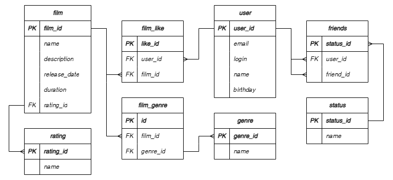

# java-filmorate

Template repository for Filmorate project.

## Схема базы данных 

### film

- Добавление фильма с указанием его id, названия, описания, даты выхода, продолжительности и рейтинга.

### user

- Добавление пользователя с указанием его id, адреса электронной почты, логина, имени и даты рождения.

### film_like

- Объединение id фильма и id пользователя, чтобы пользователь мог поставить лайк фильму.

### film_genre

- Присваивание фильму жанра.

### genre

- Список названий жанров фильмов.

### rating

- Список рейтингов Ассоциации кинокомпаний для определения возрастного ограничения фильма.

### friends

- Список друзей пользователя, которые тоже добавили его в друзья.

### status

- Статус дружбы между пользователями.

### Примеры запросов для основных операций приложения Filmorate на языке SQL для Film:

1) Получение списка добавленных фильмов - findAllFilms():
   ```<SQL>
   SELECT f.id,
          f.name AS title,
          f.description,
          f.release_date,
          f.duration,
          r.name AS rating_amp
   FROM film AS f
   LEFT JOIN rating AS r ON f.rating_id = r.rating_id; 
   ```
2) Добавление фильма - create(Film film):
   ```<SQL>
   INSERT INTO film (name, description, release_date, duration, rating)
   VALUES ({film.getName()}, {film.getDescription()}, {film.getReleaseDate()}, {film.getDuration()}, {film.getRating()});
   ```
3) Обновление фильма - update(Film film):
   ```<SQL>
   UPDATE film 
   SET 
   name = {film.getName()},
   description = {film.getDescription()},
   release_date = {film.getReleaseDate()},
   duration = {film.getDuration()},
   rating = {film.getRating()}
   WHERE id = {film.getId()};
   ```
4) Поиск фильма по id - findFilmById(Long id):
   ```<SQL>
   SELECT f.id,
          f.name AS title,
          f.description,
          f.release_date,
          f.duration,
          r.name AS rating_amp
   FROM film AS f
   LEFT JOIN rating AS r ON f.rating_id = r.rating_id
   WHERE f.id = {id};
   ```
5) Добавление пользователем лайка фильму - addLike(Long id, Long userId):
   ```<SQL>
   INSERT INTO film_like (like_id, film_id, user_id)
   VALUES ({like_id}, {id}, {userId})
   ON CONFLICT (film_id, user_id) DO NOTHING;
   ```
6) Удаление пользователем лайка фильму - removeLike(Long id, Long userId):
   ```<SQL>
   DELETE FROM film_like
   WHERE film_id = {id}
   AND user_id = {userId};
   ```
7) Получение списка популярных фильмов - getPopularFilms(int count):
   ```<SQL>
   SELECT f.id,
       f.name AS title,
       f.description,
       f.release_date,
       f.duration,
       f.name AS rating_amp,
       rf.likes
   FROM film AS f
   JOIN rating AS r ON f.rating_id = r.rating_id
   JOIN (SELECT fl.film_id,
                COUNT(fl.user_id) AS likes
         FROM film_like AS fl
         GROUP BY fl.film_id) AS rf ON f.id = rf.film_id
   ORDER BY rf.likes DESC
   LIMIT {count};
   ```
8) Указать жанр фильма - addGenre(Long filmId, Long genreId):
   ```<SQL>
   INSERT INTO film_genre (id, film_id, genre_id)
   VALUES ({id}, {filmId}, {genreId});

### Примеры запросов для основных операций приложения Filmorate на языке SQL для User:

1) Получение списка зарегистрированных пользователей - findAllUsers():
   ```<SQL>
   SELECT *
   FROM user; 
   ```
2) Добавление нового пользователя - createUser(User user):
   ```<SQL>
   INSERT INTO user (email, login, name, birthday)
   VALUES ({user.getEmail()}, {user.getLogin()}, {user.getName()}, {user.getBirthday()});
   ```
3) Обновление информации о пользователе - updateUser(User user):
   ```<SQL>
   UPDATE user
   SET
   email = {user.getEmail()},
   login = {user.getLogin()},
   name = {user.getName()},
   birthday = {user.getBirthday()}
   WHERE id = {user.getId()};
   ```
4) Поиск пользователя по id - findUserById(Long userId):
   ```<SQL>
   SELECT u.*
   FROM user AS u
   WHERE u.id = {userId};
   ```
5) Добавление пользователя в друзья - addFriend(Long id, Long friendId):
   ```<SQL>
   INSERT INTO friends (status_id, user_id, friend_id)
   VALUES ({status_id}, {userId}, {friend_id});
   ```
6) Удаление пользователя из друзей - removeFriend(Long id, Long friendId):
   ```<SQL>
   DELETE FROM friends
   WHERE user_id = {id}
   AND friend_id = {friendId};
   ```
7) Получение списка друзей пользователя с id - getFriends(Long id):
   ```<SQL>
   SELECT f.friend_id
   FROM friends AS f
   JOIN status AS s ON f.status_id = s.status_id
   WHERE f.user_id = {id}
   AND s.name = 'accepted';
   ```
8) Получение списка друзей, общих с другим пользователем - getCommonFriends(Long userId, Long otherId):
   ```<SQL>
   SELECT u2.*
   FROM user AS u1
   JOIN friends AS f ON u1.id = f.user_id
   JOIN user AS u2 ON f.friend_id = u2.id
   JOIN status AS s ON f.status_id = s.status_id
   WHERE u1.id = {userId}
      AND s.status = 'accepted'
      AND EXISTS (
          SELECT 1
          FROM friends AS of
          JOIN status AS os ON of.status_id = os.status_id
          WHERE of.user_id = {otherId}
             AND of.friend_id = u2.id
             AND os.status = 'accepted');
   ```